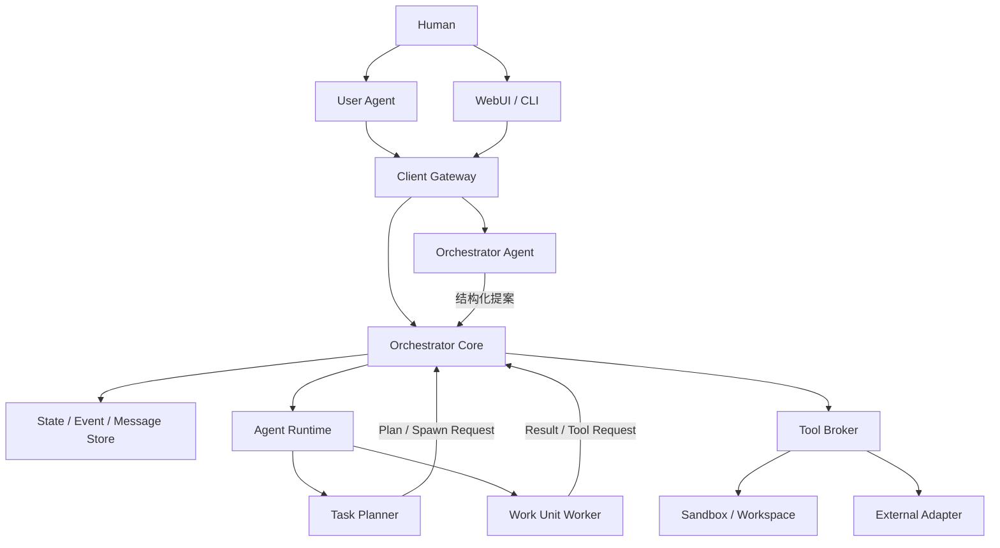

# HIBIKI — 任务中心式多 Agent 执行系统 MVP SPEC

> 版本：v0.2.1  
> 日期：2026-09-07  
> 状态：MVP 实现基线候选稿，供审阅与分阶段实施  
> 基线：用户提供的《任务中心式工作流与多 Agent 系统 MVP Spec v0.2》  
> 本版性质：完整独立修订稿，整合 v0.2 审查意见，并重组章节；不是补丁附录。  
> 项目名称：HIBIKI。本版不规定英文缩写展开。HIBIKI 与其他独立项目不共享业务定义。

>HIBIKI Is a Broker for Intent-driven Knowledge-work Interactions
>A task-oriented runtime for supervised multi-agent collaboration.


## 0. 阅读与实施约定

本 SPEC 定义产品边界、权威状态、授权、上下文、执行、异常恢复、推荐技术路线和验收标准。

- **必须 / 不得**：规范性约束，应有对应测试或可检查的实现证据。
- **推荐 / 默认**：本版给出的实施决策；可以通过 ADR 修改，但不得破坏系统不变量。
- **未来**：不计入 MVP 验收。
- 文中的性能、次数和成功率均为**建议验收目标，尚未实测**。
- 本文列出核心字段及其语义，不要求每个逻辑对象独占一张表；实现应避免重复保存同一权威事实。
- 本版修复授权与恢复语义，不增加多租户、分布式调度或新的 Agent 组织层级。

优先阅读：§1–4 产品与授权；§6–8 计划与状态；§12–19 执行协议；§22 技术栈；§24–26 验收。

### 0.1 本版主要变化

| 审查问题 | v0.2.1 决策 | 位置 |
| --- | --- | --- |
| User Agent 自报 Human 身份不能证明批准 | 服务端认证身份；正式审批使用独立 Human 入口；批准绑定不可变对象 | §3–4 |
| 等待、暂停、取消无法决定调度 | 明确状态转换、派工白名单、并行 Run 处理 | §7、§18 |
| 外部成功但回执丢失 | SideEffectIntent、稳定幂等键、UNKNOWN 与禁止盲重放 | §14 |
| 消息与状态可能分离提交 | 单事务 State + Event + Inbox/Outbox；旧 Run fencing | §12、§15、§19 |
| 隔离承诺缺少执行入口 | Tool Broker 前置检查；任意命令必须在受限环境执行 | §13 |
| Plan 变化和质量结论缺少语义 | WorkUnitSpec 固定版本、结果失效、PASS 依赖、验收快照 | §6、§8、§20 |
| Planner 生命周期缺失 | 公共 AgentRun、PlannerSession 检查点与单写代次 | §5、§9 |
| 可靠性基础过晚实现 | M0 建立协议数据；M1 验证真实执行边界；后续扩大场景 | §24 |

## 1. 产品定位、原则与边界

HIBIKI 是 **Task-centered Agent Execution System**：将 Human 提出的任务转化为正式授权，交给受控 Agent 执行，并在并行、失败、返工、人工决策和重启后保持可观察、可恢复与可验收。

### 1.1 系统不变量

| ID | 不变量 |
| --- | --- |
| INV-01 | Task 是生命周期、上下文和审计边界；Agent 是可替换计算资源。 |
| INV-02 | 首次 Contract 未被 Human 正式批准前，不得启动 PLAN / EXECUTE Run。 |
| INV-03 | Orchestrator Core 是权威业务状态的唯一写入者；LLM 只提交提案、消息和结果。 |
| INV-04 | 只有 Core 能 spawn / stop Agent；Planner 和 Worker 均不能自行创建子 Agent。 |
| INV-05 | 一个 Work Unit 可以有多次 Run；终态 Run 不得重新变为 RUNNING。 |
| INV-06 | 默认 FRESH；父 Agent transcript 不自动继承；权限不因亲属关系继承。 |
| INV-07 | 同一 mutable Workspace 同时至多有一个实际 writer；Lease 过期不足以证明旧 writer 消失。 |
| INV-08 | Internal Agent 和 User Agent 自行生成的消息不能构成 Human Authorization。 |
| INV-09 | 未批准或已失效的外部动作不得被 dispatch；结果不明的动作不得盲目重放。 |
| INV-10 | 状态改变、对应 Event 与待执行命令原子提交；重复和迟到消息不重复推进业务。 |
| INV-11 | 结果、验证证据和批准引用固定版本；旧证据不能自动证明新交付物合格。 |
| INV-12 | Human Final Acceptance 前不得进入 COMPLETED；终态保留原因与完整事实历史。 |

Orchestrator 保持最大控制权和最小必要语义上下文。Planner 持有任务级语义上下文，Worker 持有工作单元级上下文。Human 可审计协作消息，但这不扩大其他 Agent 的读取权限。

MVP 优先顺序：可靠闭环、确定性控制、减少人工协调成本，再考虑自主性。Review、Verify、Repair 是 Work Type，不是固定组织角色。

### 1.2 MVP 产品能力

自然语言 Intent、必要追问、Contract 解释与批准、简单任务直达 Worker、复杂任务 Planner + DAG、并行 Workspace、Review/Verify/Repair、Human Gate、暂停/取消/恢复、用户代理入口、消息审计、最终验收及事实归档。

### 1.3 明确不做

多租户、分布式 HA、递归 spawn、自由 Agent 群聊、Worker 直接通信、Agent marketplace、通用 Workflow DSL、拖拽编排器、自动扩大范围/权限、复杂代理授权、长期向量记忆、自动经验学习、知识图谱，以及 Human 会话所有权在内部 Agent 间转移。

MVP 面向单 Human、单 Linux 主机、单 Core 实例。可以有多个并行 Task；不要求本地部署 LLM 或 GPU。Windows 用户可以通过浏览器/CLI 使用，服务端优先 Linux 或 WSL2 Linux 环境。跨平台执行环境不作为首版承诺。

## 2. 总体架构与控制边界



图中箭头表达控制或请求关系。Planner–Worker 内容通过受控 Message Store 路由，不要求 Orchestrator Agent 阅读全文。Core 路由消息并校验元数据，不用 LLM 理解全部正文。

| 组件 | 权威责任 | 限制 |
| --- | --- | --- |
| Orchestrator Core | 状态、版本、权限、调度、Gate、预算、重试、恢复、审计 | 不承担开放式语义推理 |
| Orchestrator Agent | Intent、追问、Contract 草拟、解释、路由建议、多任务概览 | 无直接数据库写入、spawn、授权或外部执行权 |
| Planner | Task 级规划、整合、反馈、Plan Revision / Contract Delta 提案 | 无拓扑控制权；不能扩大授权 |
| Worker | 一个 Work Unit 的执行、结构化 Result 与 Artifact | 无其他 Task 上下文，无自行 spawn |
| Tool Broker | 调用前校验、执行收据、限定资源访问 | 不能自行扩大 Contract 或绕过 Gate |
| User Agent | 客户端代理、上下文提交、查询、呈现待办 | 不作为 Human 凭证来源 |

Core 的确定性校验范围是身份、版本、状态、权限、资源、结构化依赖等。自然语言需求是否满足，由评审证据和 Human Acceptance 判断；不得宣称 Schema 校验等于语义正确。

## 3. Principal、Actor、认证与 User Agent

### 3.1 身份来源

- `principal_id`：权限所属的 Human。
- `actor_id / actor_type`：当前认证凭证对应的实际调用主体。
- `auth_context_id`：认证会话或客户端登记记录；审计中只保留标识，禁止记录原始凭证。
- `delegation_id`：未来扩展，MVP 为 null。

Actor 与 Principal 必须由 Gateway 根据认证上下文填充。客户端传入的同名字段不得成为权威身份；与认证结果不一致时拒绝。内部 Run 使用独立、受限且可撤销的运行凭证，禁止复用 Human 会话。

MVP 信任边界是假设 Human 专用凭证没有泄露给 User Agent 或内部执行器。若 Hermes 与 Human CLI 共用可读取相同凭证的 OS 账户，不能声称二者得到强身份隔离；推荐正式审批使用独立浏览器会话，执行器与代理账户不能读取该会话。

### 3.2 MVP 权限矩阵

| 操作 | Human 入口 | User Agent 默认 | 内部 Agent |
| --- | --- | --- | --- |
| 创建 Intent、补充 Context、回答非授权 Clarification | 允许 | 按客户端 scope 允许 | 只能提交提案 |
| 查询 Task、Artifact、消息 | 允许 | 仅所属 Principal 与授权 Task | 仅任务及运行读取授权内 |
| 暂停、取消 | 允许 | 按显式 `task:interrupt` scope 允许 | 只能请求 |
| 恢复已暂停任务 | 允许 | 默认禁止 | 只能请求 |
| 首次 Contract、Contract Delta、Side Effect 批准 | 允许 | 禁止 | 禁止 |
| Final Acceptance | 允许 | 禁止 | 禁止 |
| spawn / stop、权威状态写入 | 通过 Core 请求 | 通过有限客户端命令 | 通过 Core 提案 |

普通 Clarification 回答不得隐式激活 Contract 或放宽权限。恢复暂停任务不能跳过尚未完成的审批。

### 3.3 User Agent 交互路径

1. Hermes 通过 MCP 创建 Intent 或查询已有 Task。
2. Core 返回待办摘要、Contract Explanation、关键授权字段以及 `decision_url`。
3. Human 在 HIBIKI 的已认证页面审阅并批准；CLI 也可使用独立 Human 凭证批准。
4. Hermes 再次查询，获得正式 Decision 的结果和任务状态。

`decision_url` 只是定位信息，不是携带批准权的 bearer link；页面不能通过 GET 执行批准。User Agent 的 `submit_decision` 不进入 MVP 默认工具集。未来若实现可信转发，必须使用单独设计的用户决策凭证或 DelegationGrant，不接受“用户说同意”作为授权证据。

## 4. Contract、Explanation 与 Decision

### 4.1 Contract 协商

Intent → 必要 Clarification → Draft Contract → Explanation + 关键字段 → Human Review → ACTIVE Contract → 正式执行。

只追问会实质影响目标、范围、验收、权限、风险、外部动作或重大技术路线的问题。非关键缺项写入 Assumptions。

批准前的 Intake 允许理解当前 Intent、读取用户明确提交的附件、生成说明；不启动 Planner/Worker，不进行开放式研究、代码执行或外部业务操作。Intake 的模型调用适用系统预先配置的模型/数据发送政策、调用上限和审计。无法在该范围内获得的信息应标注待确认。

Orchestrator Agent 在 Intake 时读取当前 Task 的 Intent、附件授权内容与 Draft；多 Task 概览时默认只读取 Task Control View。不同 Task 的语义对话分开构造，禁止为省事累积为全局 transcript。

### 4.2 TaskContract

不可变业务内容字段：

```text
task_id, contract_version, supersedes_version, content_hash
objective
in_scope, out_of_scope, constraints, assumptions
deliverables[{deliverable_id, description, expected_kind}]
acceptance_criteria[{criterion_id, statement, evidence_kind, required}]
allowed_side_effects, permission_ceiling, resource_limits, human_gates
```

状态与批准引用由 Core 管理：`DRAFT / PENDING_APPROVAL / ACTIVE / SUPERSEDED / REJECTED`。内容不可原地修改；改变 Draft 内容也产生新版本。一个 Task 至多有一个 ACTIVE Contract。`approved_by / approved_at` 从正式 Decision 关联得到，不能由 Agent 提交。

### 4.3 Explanation 与批准快照

Explanation 说明目标、覆盖范围、完成标准、允许操作、仍需批准的动作、关键假设与风险。权限、费用/资源上限、外部目标等关键字段必须从 Contract 确定性渲染；LLM 负责补充解释。

待批准快照包含：

```text
decision_id, task_id, decision_kind
target_ref, target_version, target_hash
contract_version, explanation_ref, explanation_hash
parameters_hash, result_snapshot_ref
created_at, expires_at, status
```

按 Decision 类型使用相关字段。`status = PENDING / APPROVED / REJECTED / EXPIRED / SUPERSEDED`。正式 HumanDecision 记录 choice、认证 Actor/Principal、决定时间和上述完整目标引用；已提交的决定不可覆盖。

批准事务必须校验：身份允许该动作、Decision 仍待处理、未过期、目标版本/hash 未变化、Task 状态允许该决定。过期批准返回明确错误，不能自动批准“最新版”。重复提交同一批准返回原结果，不重复执行。

### 4.4 Final Acceptance

验收绑定 `result_snapshot_id`，其中固定 Contract、Plan、交付物 hash、必需验收证据和未决事项。候选结果、必需证据或当前 Contract/Plan 改变后，原待验收 Decision 作废并重新生成。未解决的 Side Effect UNKNOWN 不得进入 COMPLETED。

拒绝首次 Contract：可修改后重新提交，或者取消。拒绝最终结果：若返工仍在授权与预算内则进入规划/执行；否则形成新的 Contract Delta。已终态 Task 不直接复活。

## 5. 核心对象、身份与版本

| 对象 | 核心字段 / 语义 |
| --- | --- |
| Task | `task_id, principal_id, intent_ref, title, state, state_reason, state_revision, contract_version, plan_version, active_planner_session_id, resume_point, final_result_refs, created_at, updated_at` |
| TaskContract | 授权内容的不可变版本，见 §4 |
| PlannerSession | `planner_session_id, task_id, generation, active_run_id, checkpoint_ref, checkpoint_version, last_consumed_message_seq, status` |
| Plan | `task_id, plan_version, base_plan_version, contract_version, content_hash, nodes, edges, required_output_refs, gate_definitions, status` |
| WorkUnitSpec | `work_unit_id, spec_version, task_id, objective, work_type, context_policy, input_refs, expected_outputs, acceptance_criteria, required_capabilities, requested_permissions, workspace_policy, content_hash` |
| WorkUnitExecution | Work Unit 当前进度：`status, active_run_id, attempt_count, next_retry_at, selected_result_ref, blocked_reason` |
| AgentProfile | 不可变 `profile_id/version`、instructions、work types、model policy、工具上限、默认上下文/隔离、max turns |
| AgentInstance | `agent_instance_id, task_id, profile_ref, adapter_type, runtime_handle, status, created_at, terminated_at`，表示实际运行主体 |
| AgentRun | 公共执行尝试，包含 PLAN / EXECUTE assignment，详见 §8–9 |
| Workspace | `workspace_id, task_id, work_unit_id, kind, base_ref, isolation_mode, state, owner_run_id, fencing_epoch, cleanup_policy` |
| ContextManifest | 每次 Run 的不可变初始上下文授权与输入快照，见 §10 |
| Artifact | 不可变内容版本、所属 Task、来源 Run、摘要、可见范围、hash |
| AgentMessage | 协作正文与控制元数据；投递状态独立于业务处理结果 |
| DecisionRequest / HumanDecision | 待决目标与正式授权事实 |
| SideEffectIntent / Receipt | 外部动作身份、执行状态及外部证据 |
| Event / Inbox / Outbox | 事实审计、输入去重和待执行命令 |
| TaskArchive | 对上述事实的终态快照与索引，不要求独立服务 |

`WorkerRun` 保留为 `AgentRun.assignment_kind = EXECUTE` 的领域称呼，不再维护第二套并行执行记录。每个 Run 必须映射到一个 Task；EXECUTE 必须绑定 Work Unit，PLAN 必须绑定 PlannerSession。

供应商的 session/thread/conversation ID 仅放在 Adapter metadata，不用作 HIBIKI 核心 ID。不可变内容与可变生命周期状态分开保存；Event 记录所有权威状态转换。

## 6. Plan、Work Unit 与版本变更

### 6.1 Plan 结构与校验

复杂 Task 使用版本化 DAG；简单 Task 由 Core 建立单 EXECUTE Work Unit 的最小 Plan。Planner 创建提案，Core 激活有效版本。

Core 必须检查：同 Task 引用、无环、节点唯一、依赖存在、固定 WorkUnitSpec 版本、权限不超上限、必需交付与验收的结构化映射存在。DAG 只支持有限依赖谓词：`DONE`、`VERDICT_PASS`，以及后者所验证的明确 Artifact hash，不引入任意表达式 DSL。

Plan 内容不可修改，状态为 `PROPOSED / ACTIVE / SUPERSEDED / REJECTED`；同 Task 至多一版 ACTIVE。Repair/Replan 通过新 Work Unit 和新 Plan 表达，不在 DAG 内构造循环。

### 6.2 Plan Revision 与 Contract Delta

| 改变 | 分类与处理 |
| --- | --- |
| 拆分工作、调整顺序、选择已授权实现方法 | PLAN_REVISION；Core 校验后可激活 |
| 在原验收范围内添加 Review / Repair | PLAN_REVISION；必须仍在预算与权限内 |
| 更改目标、范围、交付承诺、必需验收标准 | CONTRACT_DELTA；Human 批准后才生效 |
| 提高权限、增加第三方数据接收方、放宽外部动作或预算上限 | CONTRACT_DELTA；Human Gate |
| 收回权限、紧急停止 | Human 控制命令先立即生效；授权文档随后留档，不等待重新规划 |
| 语义上无法确定是否越界 | 提交解释与差异，进入 Human Decision；不得伪装成内部修订 |

Core 不凭自然语言自行证明 scope 未变化。Planner 必须申报 delta 类别、受影响字段与理由；结构化授权字段的变化由 Core 强制拦截，语义疑点交给 Human。

### 6.3 修订与运行中工作

Plan 提案携带 `expected_plan_version` 和 `expected_contract_version`。版本冲突拒绝提案并要求重建，不使用最后写入覆盖。

- 已运行 Run 固定引用启动时的 Contract、Plan、WorkUnitSpec 和输入 hash。
- 内部 Plan Revision 中，节点定义和输入均未改变的 Run 可以继续；其迟到结果仍须通过该节点的有效性检查。
- 定义或输入改变：旧节点不再作为当前 Plan 的有效依赖；新增 Work Unit 承担新工作。受影响的旧 Run 停止或仅保留历史结果，不能推进新 Plan。
- 被移除的节点保留审计记录；Pending 节点取消，运行节点走停止协议。
- Contract Delta 的激活要求旧 PLAN/EXECUTE Run 已排空或停止。新 Contract 下重新计算权限与上下文；不让旧 Run 静默跨越授权版本。
- 权限收回立即撤销受影响能力并停止相关 Run；不能以“旧版本已批准”为由继续外部调用。

Contract Delta 的批准与激活可以分为两个事务：先记录不可变 HumanDecision，再等待旧 Run 停止/排空，最后以 CAS 激活新版本。等待期间继续保持派工冻结，Gate 标记为 `APPROVED_PENDING_APPLY`；UI 展示“已批准，等待执行器停止”，不重复要求 Human 批准。适用的 Gate 生命周期为 `OPEN / APPROVED_PENDING_APPLY / RESOLVED`，独立于 Decision 的批准事实；重启后继续应用已批准且仍有效的同一目标。

### 6.4 已完成结果与下游失效

Work Unit 的定义、固定输入及对应内容 hash 均未变时，允许复用已完成结果，并记录复用依据。输入改变时创建新 Work Unit；原 DONE 保留为历史事实，不把它改回 RUNNING。

上游 Artifact hash 改变后，依赖该版本的 Integration/Verify 证据对新候选结果失效。失效沿受影响依赖传播；无关节点不必重做。不能把“内容大概一样”当作 hash 相等。

## 7. Task 状态机与调度规则

### 7.1 状态定义

| 状态 | 含义 | 允许创建业务 Run |
| --- | --- | --- |
| NEW | Intent 已保存，尚未提交正式 Contract | 否 |
| WAITING_HUMAN | 存在阻塞性问题、审批或需人处理的异常 | 否 |
| PLANNING | ACTIVE Contract 下形成或修订 Plan | PLAN，受完整 Guard 限制 |
| EXECUTING | 推进当前有效 Plan | PLAN / EXECUTE，受完整 Guard 限制 |
| VERIFYING | 必需产物已形成，剩余主要工作是验证与验收准备 | 当前 Plan 所需 Run，受完整 Guard 限制 |
| PAUSING | 停止派工，正在停止已有 Run | 否 |
| PAUSED | 已暂停；不存在可继续执行的业务 Run | 否 |
| CANCELLING | 已记录取消，正在停止与核对 | 否 |
| COMPLETED | Human 已验收固定结果快照 | 否 |
| FAILED | 已确认无法继续，保留失败原因 | 否 |
| ABORTED | 取消收尾完成，保留已经发生的事实 | 否 |

PLANNING/EXECUTING/VERIFYING 是任务主要阶段；并行时可能同时存在多种 Work Type，UI 应另列 active runs，不能从 Task 状态推断只有一种工作。

### 7.2 关键状态转换

| 当前状态 | 事件 | 前置条件 | 新状态与处理 |
| --- | --- | --- | --- |
| NEW | clarification / contract.submitted | 已保存问题或批准快照 | WAITING_HUMAN |
| WAITING_HUMAN | contract.approved | §4 的批准检查全部通过 | 激活 Contract，进入 PLANNING 或 EXECUTING |
| WAITING_HUMAN | clarification.answered | 回答来自允许的客户端 | 继续 Intake；无 ACTIVE Contract 时不派工 |
| PLANNING | plan.activated | 版本与 DAG 校验通过 | EXECUTING |
| PLANNING / EXECUTING / VERIFYING | blocking_gate.opened | 持久化待决目标 | WAITING_HUMAN，保存 resume_point |
| WAITING_HUMAN | decision.resolved | 无其他阻塞 Gate；授权仍有效 | 重新计算可推进阶段，禁止直接跳回旧指令 |
| EXECUTING | required_outputs.ready | 当前版本的产物已形成 | VERIFYING |
| VERIFYING | verification.failed | 有有效 FAIL 证据 | 预算内返工进入 PLANNING/EXECUTING，否则 WAITING_HUMAN |
| VERIFYING | acceptance.ready | 必需证据齐全，无未决外部动作 | WAITING_HUMAN(final_acceptance) |
| WAITING_HUMAN | final.accepted | 结果快照仍为当前、无 active Run | COMPLETED |
| 任意非终态，除 CANCELLING | pause.requested | 请求具备中断权限 | PAUSING；停止新派工并停止已有 Run |
| PAUSING | runtime.quiescent | 无存活业务进程、工具执行或未核对 writer | PAUSED；保留 Gate 与 UNKNOWN |
| PAUSED | resume.requested | Human 权限有效 | 先检查待决事项；进入 WAITING_HUMAN 或可运行阶段 |
| 任意非终态 | cancel.requested | 请求具备中断权限 | CANCELLING；立即撤销新执行资格 |
| CANCELLING | cancellation.settled | 无实际 writer/运行进程；未决外部事实已解决或被明确记录接受 | ABORTED |
| 非终态 | task.failed | 无可行继续路径且清理完成 | FAILED；记录证据与原因 |

未列出的转换默认拒绝。CANCELLING 期间不得通过 Pause/Resume 撤回取消。终态不回到执行态；后续工作创建新 Task，并链接原历史。

`WAITING_HUMAN.reason` 至少支持 clarification、contract_approval、contract_delta、side_effect_approval、final_acceptance、resource_limit、execution_blocked、execution_uncertain。多个 Gate 独立保存，UI 的主要 reason 是投影，不代表其他 Gate 已关闭。

HumanDecision 已提交但尚未应用时，Gate 仍阻塞调度；只有授权目标完成有效应用后才视为 decision.resolved。若期间目标被替换，保留批准历史，将该 Gate 解决为失效，并对新目标创建新的待决项。

### 7.3 并行 Run 遇到 Human Gate

MVP 使用 Task 级派工冻结：打开阻塞 Gate 后不创建新 PLAN/EXECUTE Run，不激活新的执行性 Plan 变更。既有 Run 可完成已授权的读取、纯计算和本地 Workspace 工作；新的外部副作用 dispatch 被禁止。

请求 Gate 的 Run 返回 BLOCKED 业务结果并退出，不维持一个等待用户数小时的协程。其他 Run 的结果照常审计与保存，但不能触发新下游。审批解决后重新验证版本、预算、权限和依赖再推进。

Gate 的说明和人工查询属于 Client/Intake 路径，不通过绕开 Scheduler 创建业务 Run。收到紧急撤权或取消时，既有 Run 也按停止协议处理。

## 8. Work Unit、AgentRun 与 Result 状态

### 8.1 Work Unit 状态

`PENDING / RUNNING / BLOCKED / DONE / FAILED / CANCELLED`。

| 转换 | 条件 |
| --- | --- |
| PENDING → RUNNING | 创建有效 Run 并完成调度占用 |
| RUNNING → PENDING | 可重试的 Run 失败；旧 writer 已退出；预算和次数允许 |
| RUNNING → BLOCKED | 缺信息、缺批准、输入过大、次数耗尽或结果不确定 |
| RUNNING → DONE | 当前 Run 的 Result 满足本工作单元的完成要求 |
| BLOCKED → PENDING | 阻塞已解决，定义未变，重新通过调度检查 |
| 非终态 → FAILED | 明确确认该工作单元无法继续；不用于表示普通一次失败 |
| 非终态 → CANCELLED | Task 取消或当前 Plan 移除此工作 |

DONE/FAILED/CANCELLED 不复活；定义变化或终态后的返工创建新 Work Unit。次数耗尽默认先 BLOCKED，不把每次执行故障都升级为 Task FAILED。

### 8.2 公共 AgentRun

```text
run_id, task_id, assignment_kind: PLAN | EXECUTE
planner_session_id?, work_unit_id?, work_unit_spec_version?
attempt_no, agent_instance_id, profile_id, profile_version
contract_version, plan_version, context_manifest_id, workspace_id?
model_ref, tools, granted_permissions, grant_epoch, fencing_epoch
status, terminal_reason, next_action_ref
lease_expires_at, last_heartbeat_at, started_at, finished_at
resumed_from_run_id?, result_ref, artifact_refs, error_class, usage
```

AgentRun 状态：`CREATED → RUNNING → SUCCEEDED / FAILED / TIMED_OUT / CANCELLED / LOST`。CREATED 也可直接进入失败/取消终态。LOST 表示无法可靠恢复该执行尝试，不意味着 Workspace 已可重用。

Run 终态不可逆。`SUCCEEDED` 表示执行器完成了有效 Result 提交；Work Unit 是否完成还由 Result 和对应工作定义决定。AgentInstance 的退出确认与业务 Result 是两件事，释放写锁必须等待实际 writer 退出。

### 8.3 Result Contract

```text
run_id, work_unit_spec_ref, input_fingerprint
outcome: COMPLETED | BLOCKED
summary, artifact_refs, evidence_refs
acceptance_evidence[{criterion_id, artifact_ref, evidence_ref, verdict}]
blockers, assumptions, follow_up_recommendations
context_delta_ref, usage
verdict?: PASS | FAIL | BLOCKED
verified_artifact_refs[]
```

执行器崩溃、协议错误等通过 Run error 表达，不伪造完整 Result。Review/Verify 的 FAIL 必须给出问题、证据、被检查 Artifact hash 和修复建议。

**Verify Run 可以 SUCCEEDED，Verify Work Unit 可以 DONE，而 verdict 为 FAIL。** 这表示检查报告完成，但被检查对象未通过。要求质量通过的依赖必须使用 VERDICT_PASS；不能只检查 DONE。

## 9. Planner 生命周期与 Agent Adapter

### 9.1 PlannerSession

一个复杂 Task 同时至多一个 ACTIVE PlannerSession，且该 Session 同时至多一个有效 PLAN Run。不同 Task 可各自拥有 Planner。

PlannerSession 状态：`ACTIVE / SUSPENDED / CLOSED`。核心持久现场包含当前 Contract/Plan 引用、Open Questions、工作摘要、Artifact 引用、消息消费游标及检查点版本。

每次更换或恢复 Planner，Core 提高 `generation`；Plan Proposal 必须带 generation 与 expected versions。旧 Planner 的提案可保留审计，但不得推进状态。

检查点按版本 append-only 保存；更新检查点指针和已消费消息游标在同一事务完成。消息可能被再次送达，Planner 提案仍须幂等。供应商 transcript 可以辅助恢复，但数据库中的 Contract/Plan/Decision/Message/Artifact 才是业务权威。

Planner 不需要永远驻留：等待 Worker 时可结束当前 PLAN Run。后续由新 PLAN Run 从检查点和新消息继续，Task 不因 Planner 进程退出而丢失。

### 9.2 Agent Adapter 最小接口

`start(run_spec)`、`send(run_id, message)`、`stop(run_id, reason)`、`inspect(run_id)`。

- `start` 以 run_id 幂等；相同 Run 不启动两个实际进程。
- `inspect` 必须报告运行标识、活性和停止结果；不能仅依据可复用的裸 PID 判断身份。
- `stop` 管理整个执行进程组/容器及其工具子进程，不只是模型循环。
- Adapter 将供应商特有状态转换为标准 Event/Message/Result。
- 首版实现 FakeAgentAdapter 与一个 RealAgentAdapter；CLI Agent 仅在通过相同控制能力测试后接入。

首个 Real Adapter 推荐使用 HIBIKI 管理的 API 模型调用循环。模型发出工具请求，交给 Tool Broker 授权后执行。模型供应商、SDK 和 session 格式不进入 Core 业务模型。

## 10. ContextManifest、动态输入与信息隔离

### 10.1 四层上下文

Human Conversation、Task Context、Planner Context、Worker Run Context 分开构造。Task Context 包含 Contract、Plan、Decision、Artifact 引用和工作摘要，不是无限累积的聊天记录。

Worker 默认 FRESH。RESUME 必须显式声明 `resumed_from_run_id`，重新校验当前授权和输入。FORK 仅预留，不进入 MVP。Retry 不自动等于 Resume。

### 10.2 不可变初始 Manifest

每个 PLAN / EXECUTE Run 必须具有 ContextManifest：

```text
context_manifest_id, task_id, run_id
contract_version, plan_version, assignment_ref
context_policy, profile_ref
mandatory_refs, optional_refs, excluded_categories
dependency_result_refs, artifact_refs, project_context_refs
previous_run_ref, context_budget
manifest_hash, created_at
```

所有引用固定 version/hash。Context Builder 先按权限选择输入，再 materialize；Adapter 记录实际提交的输入引用、版本/hash、模型/模板版本和必要转换。Manifest 表示授权输入，实际输入记录表示真正使用的材料，二者不得混为一谈。

Mandatory Context 超过窗口时不得静默删除。启动前将工作 BLOCKED，或者在 ACTIVE Contract 下创建明确的 Preparation/Summarization Work Unit。摘要是带来源的新 Artifact，不能冒充原始全文。

### 10.3 动态消息与工具读入

初始 Manifest 保持不可变；执行中新增输入以 append-only `ContextAppend` 记录：`run_id, sequence, reason, authorized_ref, version/hash, grant_ref, materialized_hash`。

Planner Feedback、用户补充、工具读取结果、自行生成 Artifact 的再次读取，都通过同一授权与记录路径。新资源不因进入某条消息正文就自动获得读取权。修改会影响工作定义或验收的反馈必须先走 Plan/Contract 变更。

Context Audit 应能重建材料与输入顺序，但不承诺模型输出可逐 token 重现，也不要求获取供应商未暴露的内部推理。工具输出中的敏感信息在进入模型与审计正文前按政策处理，并记录发生了脱敏。

### 10.4 Task Control View

只包含 `task_id, title, state, objective_summary, current_phase, progress_summary, contract_version, plan_version, active_planner, active_runs, work_unit_counts, blocked_reason, human_attention_required, result_refs, next_control_action`。

进度必须基于可数事实和明确摘要；禁止用任意估计百分比冒充精确完成度。需要深入解释时临时加载当前 Task 的有限引用，不能默认加载全部 Task 正文。

## 11. Workspace 与 Artifact

### 11.1 Workspace 所有权

Workspace 属于 Work Unit，跨 Run 保留；Run 退出、Context reset 或 Agent replacement 均不自动删除现场。重试前记录基线、当前修改和上次退出原因，禁止静默丢弃已有改动。

Workspace 状态至少为 `READY / LOCKED / QUARANTINED / ARCHIVED`。锁包含 `owner_run_id` 和 `fencing_epoch`。实际 writer 未确认退出时必须 QUARANTINED，禁止重分配；逻辑锁过期不等于实际文件写入权消失。

代码工作默认一 writable Work Unit 对应一 worktree/branch，由 Core 的 Workspace Service 管理。并行结果经专门 INTEGRATE Work Unit 整合，固定输入 commit/hash，冲突由整合或返工处理。

Git worktree 会关联仓库元数据；它只解决并发现场分离。Sandbox 不得通过共享 `.git` 或宿主路径读取其他未授权材料。若挂载方案无法维持访问边界，使用仅含授权基线的隔离 clone。代码基线作为明确的 project_context_ref 纳入 Manifest。[Git worktree 官方说明](https://git-scm.com/docs/git-worktree)

### 11.2 Artifact 模型与可见性

`artifact_id, task_id, producer_run_id, kind, uri, version, content_hash, size, mime_type, agent_visibility, human_visible, summary, created_at`。

Agent 可见范围为 `RUN_PRIVATE / WORK_UNIT / TASK`；`human_visible` 单独表示正常交付展示属性。所属 Human 可审计获授权保留的正文，不能由 `RUN_PRIVATE` 隐藏行为，但凭证原文不得进入 Artifact。

Agent 读取条件必须同时满足 Task 所属、可见范围、Manifest/ContextAppend 授权和资源权限。TASK 可见不表示全 Task Agent 自动读取。

文件、报告、代码、工具结果均可作为 Artifact。PR URL、网页 URL 等可变位置只是 locator；被验收的内容必须绑定 commit、内容快照或可验证的外部版本。无法获取稳定快照的引用要明确标为动态，不得用它单独证明固定交付物版本。

### 11.3 发布与文件/数据库一致性

1. 在 staging 区写入完整文件，计算 hash；需要崩溃持久性时完成文件及目录同步。
2. 原子提升到不可变内容路径。
3. Core 在数据库事务中登记 Artifact，并写 Event/Result 引用。

数据库提交前必须保证内容已可读取；写文件后数据库提交前崩溃，只产生可扫描的孤立文件，不能产生已完成却缺文件的结果。孤立文件延迟清理；被 Artifact、Manifest、Decision、ResultSnapshot 或 Archive 引用的内容不得自动回收。

## 12. 消息协议、幂等与投递

### 12.1 统一 Envelope

```yaml
protocol_version: "1"
message_id: "msg_example"
message_kind: REQUEST       # COMMAND | REQUEST | EVENT | DECISION
message_type: "work.result.submitted"
task_id: "task_example"
work_unit_id: "wu_example"
run_id: "run_example"
actor_id: "actor_from_authenticated_channel"
principal_id: "human_from_authenticated_channel"
auth_context_id: "auth_ref"
delegation_id: null
correlation_id: "correlation_ref"
causation_id: "previous_message_ref"
expected_contract_version: 1
expected_plan_version: 2
run_generation: 1
fencing_epoch: 4
idempotency_key: "stable_operation_key"
occurred_at: "2026-09-07T00:00:00Z"
payload: {}
content_refs: []
```

示例 ID 仅为结构说明。实际身份来自受认证通道。Core 接收后追加 `received_at` 和任务内单调递增的 `sequence_no`；生产者时钟不决定权威顺序。Run 事件可以另带 producer sequence，用于发现输出缺口。

`expected_plan_version` 对 Plan mutation 做严格 CAS；Run Result 则按固定 assignment 及 §6 的复用规则校验，不能因无关节点的 Plan 升版就丢弃仍有效的工作。

### 12.2 输入去重

Inbox 对认证 Actor 和 message_id 去重；业务幂等按稳定操作键另行约束。建议唯一域：`principal_id + task_id + operation_type + idempotency_key`；Task 创建使用客户端给定的创建键，不能依赖尚不存在的 task_id。

同一键、相同规范化 payload hash：返回已记录的处理结果。相同键、不同 hash：拒绝为冲突。禁止对网络超时后的同一操作随意生成新键。

无效、迟到或越权消息记录拒绝原因，但不推进 Task。重复输入不得产生第二个正式 Decision、第二次派工或第二次外部动作授权。

### 12.3 Outbox 与发送语义

Core 在状态事务中写 Outbox；dispatcher 在事务外发送。消息是至少一次投递，接收方必须幂等。投递状态 `PENDING / IN_FLIGHT / ACKED / DEAD`，领取具有持久化过期时间。发送成功但本地未记 ACK 时允许重发同一消息。

`ACKED` 表示接收方按协议确认，不等于业务成功。业务成功由独立 Result/Event 决定。超限 DEAD 进入可见诊断或 Gate，禁止静默遗失。

协作内容分类为 ASSIGNMENT、REQUEST、RESULT、FEEDBACK、CLARIFICATION、CONTROL；它与 Envelope 的 message_kind 是两个维度。

Planner↔Worker 只通过 Message Store 路由；Worker↔Worker 禁止直连。Worker 依赖通过 DAG 和固定 Artifact 传递。Core 直接创建所有 Agent，最大物理 spawn depth 为 1。

### 12.4 线协议

受控执行器使用 JSONL：stdin 接收 assignment/control；stdout 只输出标准事件；stderr 为诊断。长正文经 Artifact 引用传递；无效 JSON、未知版本、超限消息必须得到可见协议错误。

事件至少包含 agent.started、agent.message、tool.requested、tool.finished、work.progressed、artifact.published、work.result.submitted、work.failed。`tool.requested` 发生在执行前；执行器不能先调用工具再上报一个 `tool.called` 充当授权。

## 13. 权限与工具执行边界

### 13.1 权限交集

Run 实际权限为以下交集：System Policy、ACTIVE Contract permission ceiling、AgentProfile 上限、WorkUnit/Planner assignment 请求、Core 授予的 Grant。

权限至少覆盖文件读写范围、网络目标、命令/工具、外部系统动作、凭证访问方式、模型/数据接收方和资源额度。系统上限不能由 Task Contract 放宽。Planner 通常只有读取、消息和提案权限。

### 13.2 Tool Broker

每次调用必须在执行前验证：认证 Run、有效 assignment、当前 grant_epoch、Task 控制状态、资源匹配、参数摘要、预算和必要批准。检查与领取执行资格由 Core 原子裁决；实际 I/O 在数据库事务之外完成。

Run schema 中尽量不暴露未授权工具，但工具未出现在 schema 不是唯一防线。拒绝调用应进入审计；不因模型反复请求而自动放宽。

### 13.3 首版执行环境

推荐 Tool Broker 控制模型及外部 I/O，代码/任意命令运行于每 Run 的受限容器：

- 非 root、默认拒绝额外 capabilities、启用 no-new-privileges；CPU、内存、进程数和时间上限有效。
- 只挂载当前 Workspace 可写路径、授权输入只读路径和有限临时目录。
- 不挂载宿主 home、其他 Task、Human 凭证、容器管理 socket。
- 命令容器默认无外部网络；需要资料或依赖时通过授权 Broker 获取，依赖安装优先使用预构建镜像/明确准备步骤。
- 模型 API 密钥留在受信任的 Broker/Adapter 服务侧，不注入代码执行容器。
- Broker 文件工具处理路径穿越、符号链接及目标变化，不能只验证字符串前缀。

Docker 的 rootless 模式可降低守护进程权限风险；none 网络隔离提供无外部网络的基础。本 SPEC 的挂载、授权与凭证要求仍需独立落实。[Rootless mode](https://docs.docker.com/engine/security/rootless/)、[None network driver](https://docs.docker.com/engine/network/drivers/none/)

具备任意宿主 shell 或不受控凭证访问的 Adapter 不能被标记为通过隔离验收。MVP 不承诺抵抗所有内核/容器漏洞，但必须阻止普通路径访问、网络调用和工具绕过导致的越权。

## 14. Side Effect 协议

### 14.1 范围与身份

发送消息/邮件、发布、部署、Merge、付款、下单、删除、不可逆覆盖、ACL/凭证修改、向新的第三方发送数据，均属于需要明确授权的外部动作。Contract 明确覆盖的预授权动作可免再次人工批准，但仍必须登记 SideEffectIntent 和执行收据。

本地 Workspace 的可逆编辑遵循文件权限，不要求每次编辑创建外部副作用记录；向宿主其他目录写入不因此获得许可。

```text
effect_id, task_id, logical_action_key
origin_work_unit_id, request_run_id
action_type, target_ref, canonical_parameters_ref
parameters_hash, action_digest, artifact_refs
contract_version, authorization_ref, expires_at
external_idempotency_key, provider_operation_id
state, dispatch_attempts, receipt_refs, last_error, created_at
```

`logical_action_key` 标识业务上的同一个动作，跨 Run 保持稳定；例如“交付快照 X 发布到目标 Y”。它不得只使用 run_id。参数、目标或待发布内容变化必须创建新的动作身份与批准目标。

### 14.2 状态与执行

| 状态 | 含义与允许行为 |
| --- | --- |
| PROPOSED | 动作已持久化，尚未获得可执行授权 |
| WAITING_APPROVAL | 已建立 Human Gate |
| AUTHORIZED | 批准或预授权范围匹配，尚未发出 |
| DISPATCHING | 已原子领取派发资格；远端是否收到可能未知 |
| SUCCEEDED | 有可验证成功收据 |
| FAILED_CONFIRMED | 有证据确认本次动作未成功；是否重试需重新检查政策 |
| UNKNOWN | 是否产生效果不确定；禁止当作普通失败自动重试 |
| CANCELLED | 确认尚未派发且已取消 |

1. 固定参数、内容 hash 和动作目标，持久化 Intent。
2. Core 判断预授权或生成绑定该 digest 的 Decision。
3. 调用前重新校验授权、有效期、Task 状态和撤权代次；原子领取执行资格并转为 DISPATCHING。
4. External Adapter 使用固定参数及稳定外部幂等键执行，保存 Receipt。
5. 请求发出后断连、崩溃或响应不可判断时转 UNKNOWN，进入 execution_uncertain。

一次批准绑定一个逻辑动作。供应商支持幂等时，对同一动作的安全查询/重试不构成批准另一个动作。不得用 single-use 标记阻止读取已有执行结果，也不得将其复用于不同参数。

外部动作由 Core 的 dispatcher 使用绑定 effect_id 的执行资格推进；request_run_id 是来源记录，不要求等待审批的原 Run 一直存活。该资格不授予已经终止的 Run。动作实际发出前仍需检查当前 Task、Contract、参数和撤权代次；后续 Run 请求相同逻辑动作时查询已有 Intent，而非再次创建动作。

### 14.3 恢复保证

- 供应商支持可验证的幂等键或 operation 查询：在其有效窗口和语义内核对/重试；记录供应商能力与保留期。
- 不支持：UNKNOWN 不自动重放，由人工核对结果或明确创建一个新的已批准动作，并提示重复可能性。
- 超出供应商幂等保留期时，不能继续假设旧键防重复。
- 取消发生在 dispatch 之前：阻止发送；发生在 dispatch 之后：只能核对或调用供应商支持的取消/补偿，不能宣称外部效果已撤销。

HIBIKI 保证授权检查、动作去重和未知结果不盲重放；不对任意外部系统宣称端到端 exactly-once。

M1–M4 使用 FakeExternalAdapter 或受控测试端点验证协议。M5 至少实现一个有核对能力的实际 External Adapter；未实现的动作类型保持明确禁止，不以通用 shell 绕过。

## 15. 持久化、事务与权威写入

MVP 使用 Current State Tables + Append-only Event Log。数据库当前状态是运行时权威；Event 用于审计、时间线和因果重建，不要求从 Event 完整重放出全部状态。

每次控制命令在同一事务内完成：Inbox 去重/处理结果、目标 state/version 更新、对应 Event、待投递 Outbox、必要的资源/动作领取记录。任一步失败则全部回滚。数据库提交成功后再唤醒内存队列。

外部 I/O、模型请求、进程启动和文件长写入不得持有数据库事务。Outbox 将数据库事务与外部执行分开，外部结果再进入新的幂等输入事务。不得宣称文件系统和远端调用与 SQLite 属于同一原子事务。

MVP 只有一个 Core 服务实例，所有业务写请求进入同一控制服务。FastAPI、CLI 和 MCP 只调用 Application Service，不能各自创建第二个 Scheduler 或直接更新业务表。数据库唯一约束、外键和 CAS 是最后防线。

建议关键唯一约束：每 Task 一个 ACTIVE Contract/Plan；每 PlannerSession 一个有效 PLAN Run；每 Work Unit 一个有效 EXECUTE Run；每 Workspace 一个 writer owner；每逻辑外部动作一个有效身份；每任务 Event sequence 唯一。

## 16. Scheduler、预算与资源

### 16.1 派工 Guard

创建 Run 和发出启动命令前，必须在权威事务内同时满足：

1. Task 状态处于 PLANNING / EXECUTING / VERIFYING 的明确允许集合。
2. 存在 ACTIVE Contract，无阻塞 Gate、取消意图或暂停请求。
3. assignment 属于当前有效 Plan/PlannerSession，版本与 generation 有效。
4. 所有固定依赖满足；需要 PASS 的验证指向当前 Artifact hash。
5. assignment 权限、Profile、ContextManifest 可满足；无静默提权。
6. 次数、时间、模型调用、费用上限及全局/任务并发额度可用。
7. Workspace 可用，旧 writer 已退出，原子取得新的 ownership/epoch。
8. `next_retry_at` 已到达。

启动 Outbox 发送前再次检查 Task 与 epoch；已取消的待发送启动命令不得再启动 Agent。Adapter 的 start(run_id) 必须幂等。

### 16.2 公平性与计费

推荐 Task 间轮询、Task 内按依赖就绪顺序调度；不实现复杂优先级优化。PLAN/EXECUTE 均计入 Run 并发额度。Intake 使用独立的小额度，不能借 Intake 执行业务工作。

每次模型调用预留最大允许消耗，返回后对账；重试和 Planner 调用计入同一 Task 预算。供应商不能提供可核对费用时，使用调用次数/token/时间上限，并将金额标为估计值，不声称精确硬封顶。

达到资源上限默认进入 WAITING_HUMAN(resource_limit)。增加 Contract 预算需要正式批准。单 Task 额度耗尽不得停止其他健康 Task。

业务时间点如 retry_at、lease_expires_at、decision_expires_at 必须持久化。内存 timer/queue 只用于及时唤醒；丢失唤醒后数据库扫描仍能推进。

## 17. Retry、Resume 与失败分类

| 情况 | 默认动作 |
| --- | --- |
| 模型限流、短暂网络故障，且无未决业务副作用 | 有上限的退避重试，产生新 run_id |
| Worker 崩溃/超时 | 停止并确认 writer，核对外部动作，再决定重试 |
| 验证结论 FAIL | 创建 Repair/Plan Revision，不按网络故障反复重跑 Verify |
| 权限拒绝 | 不重试提权；调整授权内方案或 Human Gate |
| mandatory context overflow | BLOCKED，明确准备上下文或调整方案 |
| 无效 Result / 协议输出 | 记录原始诊断，有限重试；次数耗尽后 BLOCKED |
| 外部动作 UNKNOWN | 专用核对流程；禁止普通 Run retry 隐式重放 |
| 无法终止旧 writer | QUARANTINED；不启动同 Workspace 的新 writer |

Retry：相同 Work Unit、新 Run、默认 FRESH，通常复用原 Workspace。每次启动记录 Workspace 基线与现状；不自动清空修改。

Resume：相同 Work Unit、新 Run、显式恢复可用的旧上下文；保留 `resumed_from_run_id`。若恢复 transcript 将带入已撤销资源、过期 assignment 或不兼容模型会话，则拒绝 RESUME，允许在记录原因后另行使用 FRESH 重建。不得把 FRESH 冒充原会话恢复。

错误、上下文、次数、usage 和动作核对记录均保留。业务终态之后的继续工作创建新 Task 或新 Work Unit，不修改旧终态 Run。

## 18. Pause、Cancel 与撤权

### 18.1 Pause

Pause 在事务中记录 PAUSING，立即停止新派工和新外部 dispatch，发出 stop 命令。推荐先给予短暂的协作退出窗口，再停止整个进程组/容器。

收到有效 Result 可保存，但不能派发新工作。确认无运行进程/工具 writer 后进入 PAUSED；未完成 Work Unit 标记 BLOCKED(paused)，已完成事实不回滚。尚未解决的 Human Gate 和外部 UNKNOWN 留在数据库中。

Resume 只由 Human 入口默认允许。重新检查 Contract、待决事项、版本、权限和资源；需要继续的工作产生新 Run，默认 FRESH。PAUSED 不是冻结 OS 进程内存的承诺。

### 18.2 Cancel

1. 原子写 CANCELLING，提高撤权代次，失效未发送的启动/工具命令与待批准动作。
2. 不再创建任何业务 Agent；发出全任务停止命令。
3. Pending/Blocked Work Unit → CANCELLED；运行中工作在停止核对后结束。
4. 保留 Artifact、Workspace 现场、Message、Event 和已有外部 Receipt。
5. 核对 DISPATCHING/UNKNOWN 动作；已经发生的效果不宣称撤回。
6. 无运行进程或 writer，且外部未知结果已解决，或 Human 已显式确认将该不确定事实记录在取消报告中，才进入 ABORTED。

无法确认旧进程停止时保持 CANCELLING 并显示原因。Human 对未知外部事实的确认只允许结束内部任务，不改变 UNKNOWN 为 SUCCEEDED/FAILED，也不授权重放。

### 18.3 取消的线性化边界

取消事务提交后，Core 不再授予新的派发资格。已在此前取得派发资格的外部请求可能已被发送；这部分通过 §14 核对。停止请求与“外部操作已经撤销”必须在 UI 中区分。

## 19. Crash Recovery 与 Reconciliation

### 19.1 启动顺序

Core 启动时先取得单实例锁，暂不派工，然后检查数据库和执行器状态：

| 发现 | 必须处理 |
| --- | --- |
| CREATED Run 与待发送 start | 重新验证 Guard；按 run_id 幂等启动或取消 |
| 进程存在但数据库未记录有效 Run | 隔离/停止；不能将它自动认作授权执行 |
| Run 显示 RUNNING，但进程已消失 | 转 LOST/FAILED 并核对 Workspace 与 Side Effect |
| Lease 已过期，但进程仍存活 | 撤销控制资格；停止进程；确认前 Workspace QUARANTINED |
| Workspace 锁无有效 owner | 核查实际 writer 后才释放，不直接清锁 |
| Pending/领取超时的 Message | 按 Inbox/Outbox 去重和重投协议继续 |
| DISPATCHING / UNKNOWN Side Effect | 优先核对；禁止直接重试整个动作 |
| WAITING_HUMAN / PAUSED / CANCELLING | 恢复原控制语义，不因重启自动变为可执行 |
| 文件已存在但没有 Artifact 登记 | 作为孤立文件登记诊断并延迟清理 |
| Artifact 引用缺内容或 hash 不符 | BLOCKED，报告完整性错误，不承认交付完成 |

完成初步核对后才开放 Scheduler；仍被隔离的 Task 不影响其他 Task 的安全派工。

### 19.2 Lease、Heartbeat 与 fencing

Heartbeat 由受认证运行管理器产生并指向具体运行身份，不只相信模型自报“还活着”。推荐周期 5 秒、Lease 30 秒；业务执行时间限制与活性 Lease 是不同概念。

新 assignment/重试提高对应 epoch。Core 和 Tool Broker 拒绝旧 epoch 的控制提案和工具执行；旧 Result 只能进入历史审计，不能覆盖当前 active_run_id。文件系统不会自动理解 epoch，因此必须实际终止旧 writer 或保持隔离。

Orchestrator 重启可以选择停止存活 Run 后安全重建，不要求透明接管供应商会话；无论采用哪种恢复方式，结果和外部动作必须先核对，不能假定重跑无副作用。

### 19.3 备份与恢复

使用 SQLite Backup API 生成一致数据库备份，同时保存与该备份引用匹配的不可变 Artifact。备份过程中暂停 Artifact GC，校验引用闭包后才宣称备份完整；Workspace 未发布修改通过单独检查点/快照保留。

不要在数据库运行且使用 WAL 时仅复制 `.db` 文件当作完整备份。恢复到新目录后先 reconciliation，再允许派工。[SQLite Backup API](https://www.sqlite.org/backup.html)

**从旧备份恢复不同于当前数据库上的进程重启。** 备份之后发生的外部动作可能不在恢复出的记录中。旧备份恢复必须默认冻结受影响 Task 的外部 dispatch，并建立 recovery review；通过远端记录核对或 Human 明确处理后才恢复。不能因为备份中找不到 Receipt 就重发，也不能假定数据库恢复撤销了现实世界的操作。

## 20. 质量、审计与归档

### 20.1 交付和验收链

Contract 的每项 required criterion 必须映射到当前交付版本的 Evidence。代码修改后的验证结果必须对应修改后的 commit/hash。FAIL/BLOCKED、未解释的必需项缺失、未知外部动作均阻止 Final Acceptance 快照生成。

需要提交的最终结果至少包含：交付物、完成说明、验收证据、已发生外部动作、已知限制、未决事项以及与 Contract 的对应关系。Human 批准的是这个固定快照。

### 20.2 审计能力

Human 必须能够查到：为什么 spawn、谁请求、所用 Profile/模型/ContextManifest/Workspace/权限、Planner↔Worker 消息、工具请求及拒绝、结果版本、Decision 身份、重试原因和因果链。

消息摘要供列表浏览，正文按需展开；分页和按 Task/Work Unit/Run 筛选。记录完整的已交换消息及可获得的工具输入输出，不要求暴露模型内部未提供的推理。

读取权限同样适用于消息和 Artifact 端点。原始 secrets、Human session、供应商 token 不进入正文、Event 或导出；相关调用使用凭证引用。

### 20.3 Task Archive 与未来经验

终态保留 Intent、Contract/Explanation 各版本、Decision、Plan、Work Unit、Profiles、ContextManifest/Append、Run、Message、Artifacts、Events、Side Effects 和最终报告。

Task Archive 可以复用数据库及 Artifact Store；导出为索引与文件集合即可。Experience Library、经验提案/验证和长期语义检索均推迟。单个 Agent 一次成功不能直接改写系统经验或默认授权。

## 21. Client API、MCP、CLI 与 WebUI

### 21.1 最小应用接口

| 类别 | MVP 操作 |
| --- | --- |
| Task | create_task、get_task、list_tasks、get_task_status |
| Context | submit_context、get_pending_questions、answer_clarification |
| Decision 查询 | get_pending_decisions、get_decision、get_decision_url |
| Human 专用写入 | approve_contract、resolve_decision、accept_result、resume_task |
| 中断 | pause_task、cancel_task，按认证 scope |
| 产物与审计 | list_artifacts、get_artifact、list_task_messages、get_message、list_events |

REST、CLI、MCP 调用同一 Application Service。MCP 默认只暴露 User Agent 权限矩阵允许的操作；Human 专用操作不能仅靠工具描述中的“请用户确认”限制。

长任务创建返回 task_id，不阻塞等待完成。列表支持分页；写操作支持幂等键与 expected revision。读取和消息内容访问不因知道 ID 就自动允许。

### 21.2 MCP 首版接入

推荐官方 Python SDK，先提供 stdio bridge；bridge 以受限 User Agent 凭证调用常驻 Core API，不在每次 MCP 启动时启动第二个 Core。Hermes 与服务器异机时可经已有受保护的网络路径调用 REST，或通过受控远程启动 bridge。

Streamable HTTP MCP 作为适配扩展；启用时使用所锁定 MCP 协议版本的认证/授权要求和成熟实现。客户端 token 不得原样传给下游业务系统；MCP 会话不能代替业务权限。协议 revision、SDK release 和 Hermes 版本必须进入兼容性测试记录。[MCP Python SDK](https://github.com/modelcontextprotocol/python-sdk)、[MCP Authorization](https://modelcontextprotocol.io/specification/2025-11-25/basic/authorization)

### 21.3 Human 界面

首页为 Task Center：状态、明确进度、Human Attention、活动 Run、最新交付。Task Detail 包含 Contract、Plan、Work Unit、Decision、Activity、Artifact 和 Event。

审批页先展示目的、交付标准、关键权限、预算、目标外部动作和差异；结构化详情可展开。页面明确区分“等待批准”“正在停止”“已暂停”“结果未知”。

SSE 只承担实时刷新；断线后以持久 Event sequence/cursor 补读，必要时重新拉取当前投影。业务正确性不得依赖浏览器始终在线或收到每个 SSE 通知。

默认单用户、本地回环监听，浏览器会话与 User Agent token 分离；浏览器写请求有 CSRF/Origin 防护。远程访问需配置受保护入口与 TLS，不自动公开服务，不自研通用身份平台。

## 22. 推荐技术栈与选择理由

以下是针对 HIBIKI 的工程建议，官方资料用于核对组件能力；并非相关项目对 HIBIKI 架构的背书。资料核对日期为 2026-09-07。具体补丁版本由首次实现的依赖锁固定，不在 SPEC 中追逐最新版本。

### 22.1 推荐组合

| 层 | 推荐技术 | 选择理由与边界 |
| --- | --- | --- |
| 语言/运行时 | Python 3.13，标准 CPython | 统一 API、领域模型、执行器和测试；相对原稿 3.12，优先选择仍处于 bugfix 阶段的 3.13。兼容约束确有需要时可通过 ADR 保留 3.12。[Python 版本状态](https://devguide.python.org/versions/) |
| 数据校验 | Pydantic v2 | Contract、协议和 Result 的明确类型与 Schema；关键身份/数字字段启用严格校验，拒绝未知控制字段；校验不替代授权。[Pydantic](https://github.com/pydantic/pydantic) |
| 数据访问/迁移 | SQLAlchemy 2.0 + Alembic | 清晰事务边界和可追踪迁移；首版使用同步 Session 的短事务，避免同时引入两套访问模型。[SQLAlchemy Session](https://docs.sqlalchemy.org/en/20/orm/session_basics.html) |
| 数据库 | SQLite，本地 SSD，WAL | 单主机、单 Core 的低部署成本；WAL 仍只有一个同时 writer，适合短事务和受控串行写入，不当作分布式数据库。[SQLite WAL](https://www.sqlite.org/wal.html) |
| 调度与消息 | asyncio + SQLite Inbox/Outbox | I/O 编排留在 Python，业务计时和消息事实持久化；不增加 Redis、Celery、Kafka、NATS |
| HTTP 服务 | FastAPI + Uvicorn，单应用进程 | REST、Human 页面和查询入口共用 Application Service；禁止多 worker 各自运行 Scheduler。[FastAPI](https://fastapi.tiangolo.com/) |
| WebUI | Jinja2 + HTMX + 本地 CSS + SSE | Task 列表、表单、审批和消息查看用服务端渲染即可；初期无独立前端构建链。HTMX 和静态资源本地托管。[HTMX](https://htmx.org/docs/)、[FastAPI SSE](https://fastapi.tiangolo.com/tutorial/server-sent-events/) |
| CLI | Python argparse + JSON/文本双输出 | 避免额外交互框架；与 HTTP 调用相同应用命令，服务运行时不直接写数据库 |
| User Agent | 官方 MCP Python SDK，先 stdio | 接入 Hermes 等助手；传输适配不承载 HIBIKI 业务授权，版本需实测锁定。[MCP SDK](https://github.com/modelcontextprotocol/python-sdk) |
| Agent 执行 | FakeAdapter + API 型 RealAdapter + JSONL | 先掌控调用前权限和停止能力，再接现成 CLI；至少一种模型配置通过完整 adapter contract tests |
| Workspace | Git worktree/branch；必要时隔离 clone | 便于并行和 Integration；不把仓库目录分离当成安全隔离。[Git worktree](https://git-scm.com/docs/git-worktree) |
| 运行隔离 | Linux + Docker，优先 rootless | 任意命令受文件、网络、凭证及资源限制；Broker 掌握外部调用，不给 Worker 容器管理权。[Docker rootless](https://docs.docker.com/engine/security/rootless/) |
| Artifact | 本地不可变文件目录 + SHA-256 + DB 索引 | 易于检查、备份和恢复；MVP 不需要对象存储服务 |
| 测试 | pytest + pytest-asyncio + Hypothesis + HTTPX；少量 Playwright | 分别覆盖确定性内核、异步执行、随机时序、API 与关键审批 UI；不以覆盖率替代验收不变量 |
| 开发工具 | uv + Ruff；类型检查器选一种 | 固定依赖并保持基本代码质量；开发/CI 使用同一 lock。[uv locking](https://docs.astral.sh/uv/concepts/projects/sync/) |
| 部署/诊断 | 单 Core 进程由 systemd 或等效 supervisor 管理；JSON logging | 简单启动/重启和日志关联；业务审计仍在 DB，日志不是唯一事实源 |

### 22.2 SQLite 与异步服务的实施细节

推荐 `foreign_keys=ON`、`journal_mode=WAL`、`synchronous=FULL`、有限 busy_timeout。数据库在本机文件系统，不置于网络共享目录。接受外部并发请求，但权威写入经 Core 串行命令处理；读投影可以并发。

同步数据库短事务使用专用串行执行通道，避免阻塞主事件循环。Session 在一次事务/执行线程内创建和关闭，不跨并发任务共享；外部 I/O 不进入事务。若后续选择 AsyncSession，应整体切换一个访问模式并单独验证，不混用共享 Session。[SQLAlchemy 并发说明](https://docs.sqlalchemy.org/en/20/orm/session_basics.html#is-the-session-thread-safe-is-asyncsession-safe-to-share-in-concurrent-tasks)

### 22.3 首个模型和执行器选择

不在本版凭空指定用户账号、模型套餐或供应商。推荐从现有可用模型中选择一个支持所需结构化输出/工具调用的 API，锁定 provider、model、SDK、prompt/profile 版本，并运行协议测试。

首个 Adapter 必须验证：流式与中断行为、工具请求解析、错误分类、usage 记录、无效输出处理、停止和崩溃检测。仅宣称“兼容某 API”不能免除测试。

模型策略通过 Profile 配置：Orchestrator Agent / Planner 优先正确理解和规划，Worker 依 Work Type 选择；不在首版开发自动成本路由器。切换模型只影响新 Run，已有 Run 固定原配置。

### 22.4 暂不引入的基础设施与重新评估条件

| 暂不引入 | 当前理由 | 重新评估触发条件 |
| --- | --- | --- |
| LangGraph/Temporal 作为核心权威 | 本项目已经定义状态、Run、Gate 和恢复语义，首版避免双重生命周期 | 多主机、HA、显著超出单机管理能力；通过 Adapter 评估替换执行后端 |
| PostgreSQL | MVP 单机单 writer，运维复杂度暂未换来必要能力 | 持续写争用、多人使用或容量/运维要求超出实测边界 |
| Redis/Celery/Kafka/NATS | DB 消息与短任务调度已足够 | 独立消费者规模与吞吐确有需求 |
| React/Next.js 等完整前端栈 | 当前页面以列表、详情、审批为主 | 复杂交互成为主要产品瓶颈 |
| 向量数据库/长期记忆框架 | 当前目标是保存事实与可靠执行 | 先证明跨任务经验检索确有价值，并定义来源与验证机制 |

## 23. 推荐代码结构与依赖方向

| 包 | 职责 | 不应依赖 |
| --- | --- | --- |
| `hibiki.domain` | 对象、状态转换、权限与依赖规则 | FastAPI、ORM、供应商 SDK |
| `hibiki.application` | Command Handler、事务边界、Gate、调度用例 | 具体模型会话格式 |
| `hibiki.persistence` | SQLAlchemy、迁移、Inbox/Outbox、投影 | LLM 语义推理 |
| `hibiki.runtime` | Scheduler、AgentRun、Adapter、租约与停止 | UI 组件 |
| `hibiki.context` | Manifest、输入 materialization、读取记录 | 全局 transcript |
| `hibiki.tools` | Broker、Workspace、Sandbox、External Adapter | Human 凭证读取 |
| `hibiki.interfaces` | REST、CLI、MCP、WebUI | 直接修改业务表 |
| `tests` | domain、integration、adapter、recovery、e2e | 必须真实联网才能运行的默认测试 |

依赖从接口/基础设施指向应用与领域。只给真实可替换边界定义接口：AgentAdapter、SandboxAdapter、ExternalAdapter、ArtifactStore、Clock。不要为每个函数建立抽象工厂。

M0 起保存 Alembic migration、接口错误码、状态转换表与验收用例 ID。每个阶段更新 ADR 和已知限制，禁止以临时实现改变规范却不记录。

## 24. 分阶段交付与验收指标

### 24.1 通用测量约定

所有指标都是本版提出的**目标值**。基准环境建议为 Linux、4 vCPU、8 GiB 内存、本地 SSD、单 Core；不包含本地 LLM。实际验收必须记录硬件、OS、Python/SQLite、依赖 lock、Adapter、模型/Profile、数据库大小和测试数据版本。

确定性测试默认 FakeAgent/FakeClock/FakeExternal，无真实网络与扣费。真实模型测试单列，保留模型错误、重试、人工介入和用量；不得删除失败样本后报告成功率。

- **控制不变量**：指定验收场景内必须 100% 通过；任意越权、重复业务动作、错误状态提交均为阻塞问题。
- **业务完成率**：按预先固定的真实任务集计算，允许 Contract 预算内自动重试/返工；人工修改数据库或手工代做不算自动完成。
- **故障恢复率**：恢复为安全可继续、等待人工、隔离或正确终态均可；UNKNOWN 被盲重试不算恢复成功。
- **性能**：只统计 HIBIKI 控制与查询延迟，模型和第三方等待单列；相同环境可复测。
- 每阶段产出一份带用例 ID、通过/失败、证据路径和已知限制的验收记录。不得以覆盖率数字或演示视频代替证据。

### 24.2 阶段总览

| 阶段 | 可交付结果 | 核心验收门槛 |
| --- | --- | --- |
| M0 确定性内核 | 无 LLM 的 Contract→Plan→Run→Decision 闭环 | 28 个基础情形通过；100 组固定种子的随机时序，无不变量违规 |
| M1 单 Worker | 一个受控真实执行器产出可验收 Artifact | 隔离用例全部通过；固定 6 次真实运行至少 5 次在预算内完成 |
| M2 Planner 与协作 | DAG、并行、Integration、Verify/Repair、Planner 恢复 | 固定复杂样例完成；Fake 场景 20 次无调度/版本错误；真实复杂任务至少 2/3 完成 |
| M3 Human 与 User Agent | WebUI、自然语言协商、Hermes MCP 入口 | Hermes 的 3 次完整用户流程通过；全部代理越权/过期批准用例拒绝正确 |
| M4 审计与质量 | 可查询完整协作、输入、结果与授权因果链 | 10 个样本 Task 必需引用完整率 100%；审计问题全部可回答；无测试秘密泄露 |
| M5 可靠性与发布 | 故障注入、外部动作核对、备份恢复、最终基准 | 160 次故障注入零不安全恢复；24h soak；10 次真实任务至少 9 次闭环 |

“100%”限定于定义的测试集合，不作为对所有未来输入的数学证明。真实任务未达目标时保留诊断，可调整模型/Profile或缩小已声明支持的任务类型后重新固定样本集，不能只放宽控制约束。

### 24.3 M0 — Deterministic Kernel

**范围：**Domain models、SQLite migration、Task/Contract/Decision/Plan/WorkUnit/AgentRun、状态转换、权限 Guard、消息和最小审计、Inbox/Outbox、SideEffectIntent 模型、FakeAdapter、取消/暂停/重试、CLI 测试入口。

必须完成：

- H-001–H-021 与 H-044–H-050 的 Fake 实现共 28 个情形全部通过。
- 100 个固定随机种子，每条轨迹至少 200 次合法/非法/重复/迟到输入；零非法状态迁移、重复正式批准和重复有效派工。失败种子可重放。
- 在事务提交前、提交后通知前注入崩溃；状态、Event、Outbox 无部分提交，丢失唤醒可通过扫描继续。
- 数据库可从空目录迁移到当前 schema，且 schema 版本不明时启动失败并给出可诊断信息。
- 无 LLM、无公网条件下可运行全部 M0 验收。

**阶段门槛：**状态与授权协议可冻结为首版 schema。完整 UI、真实容器和供应商 API 不要求在 M0 完成。

### 24.4 M1 — Real Worker 与执行边界

**范围：**一个 API 型 Adapter、Tool Broker、Sandbox、Workspace、Artifact 发布、ContextManifest/Append、真实进程停止与最低恢复能力。

必须完成：

- H-022–H-032 全部通过；H-019 的旧 writer 场景改用真实子进程/容器验证。
- 路径穿越、符号链接逃逸、跨 Task 文件/Artifact、禁止网络、Human/供应商凭证探测等拒绝场景全部通过。
- 预先固定三个简单任务，每个运行两次：附件摘要与结构化结果、小型文件转换、受控样例仓库代码修改与测试。6 次至少 5 次在预算内完成；所有失败可解释，零越权。
- 每个真实 Run 的 Profile、Manifest、实际输入、工具请求、Result 和 Artifact hash 记录完整率 100%。
- 对可终止测试进程，Pause/Cancel 从命令提交到执行器退出不超过 15 秒；无法确认退出的特殊故障必须保持隔离，不假报已停止。
- 模型请求中断、Worker 崩溃、发布文件阶段崩溃各有一个可重复恢复用例；不要求透明恢复同一模型会话。

**阶段门槛：**允许受控真实任务，不允许未经验证的宿主 shell Adapter。外部业务动作仍限 Fake/测试端点。

### 24.5 M2 — Planner / DAG / Integration

**范围：**PlannerSession、公共 PLAN Run、检查点、Plan Revision/Contract Delta、并行调度、集成、质量依赖和返工。

必须完成：

- H-033–H-038 全部通过；H-011、H-013–H-016 使用完整多 Agent Runtime 再验收。
- 固定复杂样例至少有两个可并行 Work Unit、一个 INTEGRATE、一个 VERIFY，并注入一次 FAIL→REPAIR→重新 VERIFY。
- 用 barrier 确认两个无冲突 Worker 实际同时处于执行区间；相同 Workspace 的 writer 始终串行。不能仅靠日志时间接近声称并行。
- 同一 Fake 复杂场景运行 20 次，含乱序结果和重复消息，零重复 Work Unit、失效结果复用或绕过 PASS Gate。
- 在 Plan Proposal 前后及消费消息前后终止 Planner，恢复后不遗漏 Worker Result，旧 generation 提案不能生效。
- 预先固定三个真实复杂任务，至少两个在预算内完成；三者的协作与失败过程均能重建。

**阶段门槛：**复杂 Task 可闭环；无需增加多 Planner 讨论或 Worker 群聊。

### 24.6 M3 — Human Control / WebUI / User Agent

**范围：**Orchestrator Agent 的 Intake、必要追问、Explanation、正式审批页、最小 Task Center、REST/CLI/MCP、Hermes 代理入口。

必须完成：

- H-039–H-043 全部通过；H-002–H-004 经真实 Gateway/认证路径复验。
- 使用实际配置的 Hermes 完成三次流程：创建→获取追问→补充→获得审批链接→Human 批准→查询进度→Human 验收。
- Human 默认无需阅读完整 Schema 即可找到目的、交付标准、权限、预算及需再次批准的动作；五项关键字段在每个测试审批页均与 Contract 一致。
- User Agent 伪造 Actor、请求正式批准、使用 Human 专用 endpoint、批准过期版本均被拒绝且有审计。
- 关闭页面/断开 SSE 后重连，状态与事件补读一致；不得重复提交同一 Decision。
- 在基准环境 10 个非终态 Task、4 个 Fake active Run 下，连续 1,000 次任务查询的服务端 p95 ≤ 500 ms；控制命令持久化应答 p95 ≤ 1 秒，不含执行完成时间。

**阶段门槛：**Human 能从一个入口处理 Intent、Decision 和 Acceptance；Hermes 不持有正式批准权。

### 24.7 M4 — Quality / Audit / Archive

**范围：**Message Inspector、Timeline、Context Audit、结果/证据追踪、Archive 导出和诊断体验。底层记录此前已经存在，本阶段完善检索和展示。

必须完成：

- H-042、H-055 通过；从此前阶段选 10 个 Task，覆盖成功、失败、暂停、取消、返工与待决。
- 必需引用完整率 100%：每 Run 都能关联 assignment、Profile、ContextManifest、权限、Workspace（若适用）、消息和结果；每个批准都能定位原目标 hash。
- 对这 10 个样本，Human 均可回答：为什么 spawn、当时读了什么、哪个证据验证哪个版本、谁批准了什么、失败后发生了什么。
- 注入测试用秘密标记，确认不出现在模型可见工具输出、普通日志、消息正文与归档导出中；保留脱敏事实。
- 10,000 条消息的 Task 可以分页查询；基准环境每页 50 条的查询 p95 ≤ 500 ms，长正文按需加载。
- Archive 引用的所有固定 Artifact hash 校验通过；清理未引用 staging 文件不损坏历史。

**阶段门槛：**协作可审计、结果可追溯；自动提炼 Experience 仍不实现。

### 24.8 M5 — Reliability / Recovery / MVP Release

**范围：**故障注入、Side Effect Adapter、进程核对、预算公平性、备份/恢复、长时运行与最终真实任务基准。

必须完成：

- H-044–H-056 全部通过；至少一个实际 External Adapter 在受控目标上展示执行回执及结果核对。优先选具有稳定对象 ID 和查询接口的测试资源写入，不以付款/生产发布作为首个验收目标。
- 以下 8 个故障点各重复 20 次，共 160 次：事务提交前、提交后唤醒前、进程启动后登记前、Worker 写入中、Planner checkpoint 前、外部请求发出前、外部成功回执落库前、取消提交与迟到结果交错。
- 160 次均恢复到正确执行/终态或明确 WAITING/QUARANTINED 状态；零未授权 dispatch、双 writer、旧结果覆盖或 UNKNOWN 盲重放。
- 支持幂等的测试外部系统对同一 effect_id 的实际业务效果计数为 1；非幂等系统在结果不明后无自动第二次 dispatch。
- 基准数据集 100 个非终态 Task、10,000 条消息：Core 启动后 30 秒内完成初步分类并开放健康 Task 调度；无法核对的外部调用单列，不要求 30 秒内得出远端事实。
- 三份备份分别恢复到全新目录，数据库完整性检查、引用闭包和 Artifact hash 全部通过；PAUSED/WAITING 状态及未知动作保持原语义。
- 24 小时 Fake soak，至少 100 个 Task，周期性暂停、重试、重启；无遗失任务、无限重试或并发上限突破。结束后 active process 与 Workspace owner 一一匹配，无未解释孤儿。
- 固定 10 次真实任务，覆盖简单、并行、返工、Human Gate 和故障恢复，至少 9 次在授权预算内完成并供 Human 验收；未完成样本有明确原因及安全停留状态。

**阶段门槛：**所有控制不变量通过，真实任务达到目标，备份可恢复，已知限制对用户可见后，才宣称 MVP 完成。

## 25. 核心验收目录

以下 ID 用于 issue、测试、阶段报告和回归记录。一个情形可以拆成多个测试，不要求测试函数数量等于情形数量。

| ID | 场景 | 必须观察到的结果 |
| --- | --- | --- |
| H-001 | 无 ACTIVE Contract 请求启动业务 Agent | 无 PLAN/EXECUTE Run 被派发；拒绝有原因 |
| H-002 | User Agent / Internal Agent 自报 HUMAN 并批准 | 服务端拒绝；无授权变化 |
| H-003 | Contract/Explanation 目标变化后提交旧批准 | 版本/hash 冲突；不能自动批准新目标 |
| H-004 | 重复提交同一 Human Decision | 返回同一结果，只有一份正式决定 |
| H-005 | 同一幂等键提交不同 payload | 冲突拒绝，无部分状态改变 |
| H-006 | start Outbox 未发送时 Human Cancel | 待发送命令失效，无新 Agent 启动 |
| H-007 | 并行 Worker 中一个打开 Gate | 停止全 Task 新派工；已有有效结果保留，无新下游 |
| H-008 | Pause 后 Resume，仍有待审批事项 | 新 Run 不绕过 Gate，暂停不保活等待协程 |
| H-009 | State/Event/Outbox 事务前后崩溃 | 全部提交或全部回滚；通知丢失可扫描恢复 |
| H-010 | 旧 Run 超时后迟到完成 | 不覆盖当前 Run/结果；迟到事实可审计 |
| H-011 | Planner 更换 generation 后旧提案到达 | 拒绝推进 Plan，不重复创建工作 |
| H-012 | 修改 AgentProfile | 既有 Run 保持旧 Profile version |
| H-013 | Verify 执行成功但 verdict=FAIL | 检查报告完成，依赖 PASS 的交付被阻止 |
| H-014 | Plan 提案试图改变授权/验收 | 进入 Contract Delta，不内部放行 |
| H-015 | 无关节点引起 Plan 升版 | 未改变 assignment 的结果可按规则使用 |
| H-016 | 上游 Artifact 更新，旧验证仍为 PASS | 旧证据不适用于新版本；新验证必需 |
| H-017 | 系统声称工作完成但无 Final Acceptance | Task 不进入 COMPLETED |
| H-018 | Planner、Worker、Retry 合计达到预算上限 | 停止新增消耗，进入明确资源 Gate |
| H-019 | Lease 已过期而旧 writer 仍存活 | Workspace 隔离；禁止第二 writer |
| H-020 | 重启遇到 PAUSED/WAITING_HUMAN | 保持控制状态，无自动派工 |
| H-021 | 生产者时间倒退/自报 sequence | Core 接收序号仍单调，时间不重排权威事实 |
| H-022 | 简单 Task 执行 | 单 Work Unit 直达真实 Worker，无强制 Planner |
| H-023 | Worker FRESH 与父 transcript | 只读取授权输入，无隐式继承 |
| H-024 | Mandatory Context 超窗口 | BLOCKED 或明确准备任务，无静默裁剪 |
| H-025 | 执行中接收 Feedback/新增读取 | 有 ContextAppend、来源与固定版本 |
| H-026 | 读取未授权 Artifact/消息或其他 Task | 拒绝访问，不因猜中 ID 放行 |
| H-027 | shell/文件工具路径穿越与 symlink | 无越界读写，拒绝被记录 |
| H-028 | 命令容器访问外网、Human/供应商密钥 | 无未授权连接或凭证获取 |
| H-029 | 同 Workspace 同时请求两个 writer | 只有一个实际 writer 获准 |
| H-030 | Run 失败后 Retry / 显式 Resume | 新 run_id；现场保留；上下文模式准确记录 |
| H-031 | Artifact 文件发布与 DB 登记之间崩溃 | 无“已完成但缺文件”；孤立文件可检查 |
| H-032 | Adapter 无法拦截工具或可靠 stop | 不通过受控执行能力验收 |
| H-033 | Plan 含环、悬空依赖或跨 Task 节点 | 激活拒绝，旧有效 Plan 不受破坏 |
| H-034 | Planner 自行 spawn / Worker 直连派任务 | 拒绝；正式派工只来自 Core |
| H-035 | 两个无依赖、无 Workspace 冲突的 Worker | barrier 证明实际并行 |
| H-036 | Planner 消费消息/保存 checkpoint 中崩溃 | 恢复不丢结果，重复提案不重复执行 |
| H-037 | 并行代码产生集成冲突 | 由 Integration/Repair 处理，原产物保留 |
| H-038 | FAIL→Repair→新版 Verify→验收 | 新 PASS 绑定新 hash；旧 PASS/FAIL 不替代新证据 |
| H-039 | Hermes 创建并查询完整 Task | 外部入口可用；Human 独立完成正式批准 |
| H-040 | 审批页解释与关键字段展示 | 与不可变批准快照一致 |
| H-041 | SSE 断线/重连/重复通知 | 投影补读一致，通知不直接重复业务写入 |
| H-042 | 分页查看 Planner–Worker 消息 | sender/recipient/因果链/正文均可追踪 |
| H-043 | 受限 User Agent 中断与恢复请求 | 只执行授权 scope 内操作；不能默认恢复/批准 |
| H-044 | 无预授权且无批准的外部动作 | 未发生 dispatch，有待审批记录 |
| H-045 | 批准后替换参数/目标/交付内容 | 摘要不匹配，旧批准不能执行新动作 |
| H-046 | 外部派发前后崩溃 | 使用持久动作身份核对，不凭 Run 重跑猜测 |
| H-047 | 远端成功但本地回执丢失，支持幂等 | 核对为成功，实际业务效果计数为 1 |
| H-048 | 同一故障，远端不支持幂等/查询 | UNKNOWN 且无自动第二次派发 |
| H-049 | Run 更换后再次请求相同逻辑动作 | 复用 effect_id/外部幂等身份，不创建第二次效果 |
| H-050 | 外部已派发后 Cancel | 保留事实与不确定性，不声称撤销；不盲重放 |
| H-051 | 一致备份恢复至新目录 | DB、Artifact 引用与 hash 完整；旧备份默认冻结外部 dispatch 并核对快照之后的动作 |
| H-052 | 有进程但无有效 Run | 隔离/停止；不擅自接纳为授权工作 |
| H-053 | 单 Task 阻塞/耗尽预算，多 Task 并存 | 健康 Task 能继续；全局/任务并发不突破 |
| H-054 | 重启和并发压力后的数据库检查 | 完整性有效，Task/Run/Event 无无法解释的断链 |
| H-055 | 归档、消息与日志的敏感测试标记 | 不泄露原始凭证；脱敏行为可审计 |
| H-056 | 固定真实任务最终基准 | 达到 §24.8 目标，失败样本不被删去 |

## 26. Definition of Done

MVP 必须同时满足：

- Domain Model、状态转换、权限、版本与协议已有实施基线和迁移。
- M0–M5 各阶段验收记录齐全，所有 H-001–H-056 必需情形通过对应验证。
- 至少一个真实 API Agent Adapter、一个受控命令 Sandbox、一个可核对的实际 External Adapter 可用。
- 简单任务无需 Planner；复杂任务能形成 DAG、并行、整合和返工。
- 用户可通过 WebUI/CLI 正式批准，通过 Hermes 等 User Agent 创建、补充和查询任务。
- Worker/Planner 的输入、权限、消息与产物版本可审计；Task 之间访问边界已验证。
- Pause/Cancel/Retry/Resume、迟到消息、进程失联、外部 UNKNOWN 的行为确定。
- 不产生未授权外部动作；对测试过的幂等系统不产生重复业务效果；未知结果不盲重放。
- Human Final Acceptance 绑定当前结果快照；终态均有原因与归档。
- 备份可恢复，运行说明包含支持的 Adapter、动作类型、限制和故障处理方式。

未来能力不作为未完成 MVP 的理由。若某类 Adapter/外部动作无法满足约束，必须明确不支持，不能通过隐藏的 unrestricted 模式纳入“已完成”。

## 27. 推荐默认值与容量边界

以下为首次实现的建议配置，必须可查看并进入运行快照。它们用于限制意外扩散，可在不破坏授权的前提下调整。

| 配置 | 建议默认 | 说明 |
| --- | --- | --- |
| Core 实例数 | 1 | 禁止多个 Scheduler 同时操作同一数据目录 |
| 全局 PLAN/EXECUTE 并发 | 4 | 两类 Run 合计计数 |
| 每 Task Run 并发 | 2 | Planner 也计入；避免单任务占满 |
| 每 Task 活跃 PlannerSession | 1 | Session 内最多一个有效 PLAN Run |
| Intake 并发 | 1 | 独立低额度，只允许协商工作 |
| 每 Work Unit 最大尝试次数 | 3，含首次 | 用尽后 BLOCKED，继续需要明确决定 |
| 每 Run 模型轮次上限 | 30 | 具体 Profile 可以进一步收窄 |
| 每 Task 模型调用上限 | 200 | 含规划、执行、重试；金额上限由 Contract 明确 |
| 每 Task Intake 调用上限 | 10 | 超限提示用户整理需求；不自动无限追问 |
| 每 Task 最大 Plan 修订次数 | 10 | 防止无限重规划，超限进入 Gate |
| 每 Task 最大 Work Unit 数 | 30 | 包括返工；扩大需明确资源决定 |
| Heartbeat / Lease | 5 秒 / 30 秒 | 失联触发核对，不直接证明进程死亡 |
| 单 Run wall timeout | 30 分钟 | Work Type/Profile 可显式调整 |
| 协作停止窗口 | 10 秒 | 随后强制停止，最终仍检查实际退出 |
| 重试退避 | 2 秒、5 秒，可加有界 jitter | 时间点持久化；仅用于允许的技术故障 |
| 调度补扫周期 | 1 秒 | 通知丢失时仍能恢复推进 |
| 普通 Decision 有效期 | 24 小时 | 过期后重新呈现当前快照 |
| 单次 Side Effect 批准有效期 | 15 分钟 | 已派发动作的核对不受该过期重新定义 |
| 消息列表页大小 | 50，上限 200 | 大正文通过引用单独加载 |
| 保留政策 | 终态不自动删除被引用事实 | GC 仅清理确认无引用的临时材料 |

调高 Contract 中的预算/规模上限必须走授权变更；调低系统限制可以立即限制新消耗。初版只承诺在指定基准和实测范围内运行，不能从 SQLite 或 asyncio 的选择直接推导任意规模能力。

## 28. 后续能力与产品判断

复杂 Delegation、更多模型/CLI Adapter、HTTP MCP 部署、自动经验提炼、长期检索、多租户、多主机、Temporal Backend、先进 Sandbox、可视化工作流编辑器均在 MVP 后按证据重新评估。

新增 Feature 必须回答：是否帮助真实 Task 闭环；没有它是否产生不可恢复/不可审计状态；是否减少 Human 协调成本；它提高可靠性还是主要增加自主性。

HIBIKI 的首要成果是可验收的任务执行闭环。User Agent 是入口，Task Archive 是事实历史，二者均不形成另一套任务权威。

## 29. v0.2 对照与实施取舍

| 原稿范围 | 本版对应 | 保留/修订说明 |
| --- | --- | --- |
| §0–5 定位、原则、架构 | §1–2 | 保留 Task First、薄控制平面、最小上下文与可观察协作 |
| §6–9 User Agent/身份/Core | §2–4、§21 | 收紧正式批准入口；身份来自认证，解释绑定快照 |
| §10–18 角色和核心对象 | §5–9 | 统一 AgentRun；补 WorkUnitSpec、PlannerSession 与 Plan mutation |
| §19–30 Workspace/Context/Result | §8、§10–11 | 固定版本、动态输入审计、质量 verdict、实际 writer 隔离 |
| §31–38 Message/Protocol/Permission | §12–14 | 补幂等域、前置工具检查、外部动作状态 |
| §39–47 状态/取消/恢复/持久化 | §7–8、§15–19 | 明确暂停与取消态、事务、fencing 和 UNKNOWN |
| §48–51 Archive/入口 | §20–21、§28 | 保留事实归档和 User Agent 入口，经验学习仍推迟 |
| §52–58 技术路线/运行时 | §9、§13、§22–23 | 单体路线保留；Python 推荐 3.13；先受控 API Adapter |
| §59–66 可观测/里程碑/验收 | §20、§24–28 | 基础可靠性前置；提供阶段门槛、56 项验收与默认参数 |

本版没有把高级 Sandbox 或通用 Delegation 提前为新平台工程；前置的是兑现已有权限承诺所需的最小执行边界，以及正式 Human 批准的可信入口。

## 30. 官方技术参考

外部资料只支持对应组件能力；HIBIKI 的权限、状态、事务、预算和验收决策由本 SPEC 提出。实现时按锁定版本核对 API，不能直接使用 draft 文档覆盖已测试协议。

| 主题 | 官方资料 |
| --- | --- |
| Python 支持周期 | [Status of Python versions](https://devguide.python.org/versions/) |
| Pydantic v2 | [Pydantic repository](https://github.com/pydantic/pydantic) |
| SQLAlchemy 事务与并发 | [Session Basics, 2.0](https://docs.sqlalchemy.org/en/20/orm/session_basics.html) |
| SQLite WAL | [Write-Ahead Logging](https://www.sqlite.org/wal.html) |
| 一致备份 | [SQLite Backup API](https://www.sqlite.org/backup.html) |
| HTTP 与服务端事件 | [FastAPI](https://fastapi.tiangolo.com/)、[Server-Sent Events](https://fastapi.tiangolo.com/tutorial/server-sent-events/) |
| 轻量页面交互 | [HTMX Documentation](https://htmx.org/docs/) |
| MCP SDK 与传输 | [Official Python SDK](https://github.com/modelcontextprotocol/python-sdk)、[2025-11-25 Transports](https://modelcontextprotocol.io/specification/2025-11-25/basic/transports) |
| MCP 授权边界 | [2025-11-25 Authorization](https://modelcontextprotocol.io/specification/2025-11-25/basic/authorization) |
| Git 并行现场 | [git-worktree](https://git-scm.com/docs/git-worktree) |
| 容器运行权限与网络 | [Rootless mode](https://docs.docker.com/engine/security/rootless/)、[None network driver](https://docs.docker.com/engine/network/drivers/none/) |
| 可复现依赖 | [uv Locking and syncing](https://docs.astral.sh/uv/concepts/projects/sync/) |

HIBIKI MVP 的最终判断标准：在明确授权内完成真实 Task；发生不确定情况时保持事实、停止猜测性执行，并把需要 Human 决定的事项清楚交还。
